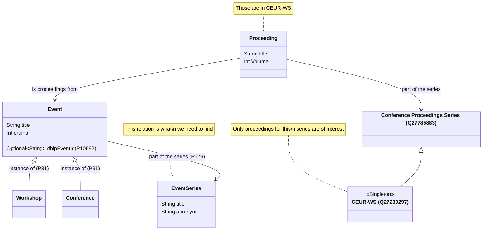
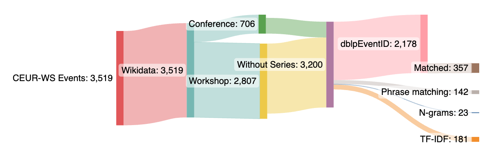

# Event Series Completion Group Project 2023

### Task

1. Find [CEUR-WS](https://ceur-ws.org/) related academic events in [wikidata](https://www.wikidata.org/wiki/Q27230297)
2. Some events have the [property 179](https://www.wikidata.org/wiki/Property:P179) (**part of the series**)
3. For all events that dont have this property find whether,
    - they are part of a conference/workshop series or
    - they are a standalone event
6. Match events to their event series and update the property.

#### Relations of Proceedings, Events, Series

#### Current Progress

- Extracted relevant events from wikidata
- Implemented first matching-algorithms
- Parsed and scraped events and their series from [dblp](https://dblp.org) that are related to CEUR-WS
    - Extracted meta-information, event-information, event-series-information
    - Matched conferences to their series if they have `dblpEventSeriesId`
- 

### Structure

- NOTE: The project organization is currently under refactoring
- The main module is `eventseries`
    - More information about *dblp* can be found in `eventseries/src/main/dblp`
    - Resources like `.json`, `.pickle` or `.csv` files are located in `eventseries/src/main/resources`
- Dataexploration and experiments are within notebooks in `notebooks`
    - Data used within the notebooks should be placed in `data`